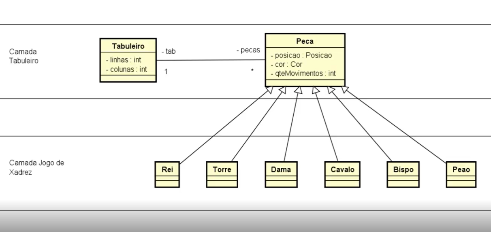

# Aplicação com C#

> Jogo de xadrez para rodar no console em C#

## Imagens

  

## Resumo

O objetivo era ganhar experiência com matrizes, herança, exceões, composição, POO em geral;  

## Versões - Histórico

* 0.0.2
    * Correções
* 0.0.1
    * Criação do sistema

## 

[https://github.com/JamesOliveira1](https://github.com/JamesOliveira1/)

